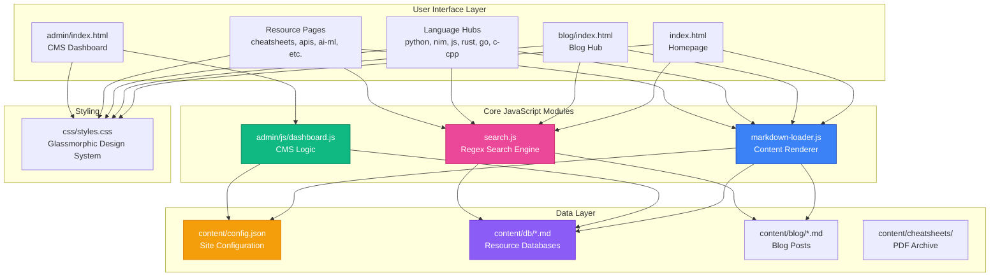

# 0x3d Hub 🌌

**0x3d Hub** is a premium, high-performance technical knowledge nexus. It curates advanced resources, development patterns, and digital frontiers into a unified, aesthetic dashboard. Built entirely with vanilla HTML, CSS, and JavaScript—no framework bloat, no backend dependencies.


---

## 🚀 Key Features

- **Multi-Hub Architecture**: Dedicated sections for Python, JavaScript, C/C++, Rust, Go, and Nim
- **Specialized Resource Centers**: Curated repositories for AI & ML, Cybersecurity, Design, DevOps, and more
- **Master Vault**: 1000+ categorized technical links, cheatsheets, and web tools
- **Regex-Powered Search**: Site-wide search with case-sensitivity and regex support (`Ctrl + /`)
- **Lightweight CMS**: Client-side admin dashboard for managing markdown databases
- **Glassmorphic UI**: Modern, translucent design with smooth animations
- **100% Static**: No server-side processing—perfect for GitHub Pages

---

## 🏗️ Architecture Overview



---

## 📂 Project Structure

```
0x3d-Hub/
├── index.html              # Homepage with hero and hub grid
├── blog/
│   ├── index.html          # Blog listing page
│   └── post.html           # Individual blog post viewer
├── {language}/
│   └── index.html          # Language hub (python, nim, js, rust, go, c-cpp)
├── resources/
│   └── *.html              # Resource pages (cheatsheets, apis, ai-ml, etc.)
├── admin/
│   ├── index.html          # CMS dashboard
│   ├── js/dashboard.js     # Admin logic
│   └── css/dashboard.css   # Admin styling
├── content/
│   ├── config.json         # Navigation, social links, resource metadata
│   ├── db/
│   │   ├── python.md       # Python resources database
│   │   ├── nim.md          # Nim resources database
│   │   ├── js.md           # JavaScript resources database
│   │   ├── apis.md         # Public APIs database
│   │   ├── cheatsheets.md  # Cheatsheet index
│   │   └── ...             # Other resource databases
│   ├── blog/
│   │   ├── posts.json      # Blog metadata
│   │   └── *.md            # Blog posts
│   └── cheatsheets/
│       └── *.pdf           # Cheatsheet PDFs
├── js/
│   ├── markdown-loader.js  # Core content renderer
│   ├── search.js           # Search engine
│   └── script.js           # Utility functions
├── css/
│   └── styles.css          # Global design system
└── img/                    # Images and assets
```

---

## ⚠️ Important: Before You Deploy

> [!CAUTION]
> **DO NOT deploy this site without updating the following:**

### 1. **Update SEO Metadata**

Edit `index.html` and all other HTML files to replace hardcoded URLs and metadata:

- **Meta tags**: Update `og:url`, `og:image`, `twitter:url`, `twitter:image`, and `canonical` links
- **Site name**: Replace "0x3d Hub" with your own
- **Description**: Customize the site description
- **Keywords**: Update meta keywords to match your content
- **Author**: Change the author name

**Example in `index.html`:**
```html
<link rel="canonical" href="https://YOUR-DOMAIN.com/" />
<meta property="og:url" content="https://YOUR-DOMAIN.com/" />
<meta property="og:image" content="https://YOUR-DOMAIN.com/img/logo.png" />
```

### 2. **Update Sitemap**

Edit `sitemap.xml` to replace all URLs:

```xml
<url>
  <loc>https://YOUR-DOMAIN.com/</loc>
  <lastmod>2026-02-10</lastmod>
  <priority>1.0</priority>
</url>
```

Update all entries with your own domain and ensure all pages are listed.

### 3. **Update Config**

Edit `content/config.json`:

- **Social links**: Replace GitHub, Discord, Twitter, and Email with your own
- **Site name**: Update the site name in the config
- **Navigation**: Ensure all URLs point to your domain (if using a custom domain)

### 4. **Update CNAME (if using custom domain)**

If using a custom domain, update the `CNAME` file:

```
your-custom-domain.com
```

### 5. **Update robots.txt**

Edit `robots.txt` to point to your sitemap:

```
Sitemap: https://YOUR-DOMAIN.com/sitemap.xml
```

---

## 🔧 How It Works

### 1. **Content Management**

All content is stored in **Markdown** files (`content/db/*.md`) for easy editing and version control. Each markdown file follows this structure:

```markdown
# Resource Title

Description of the resource hub.

## Category Name

- [Resource Name](https://example.com) - Brief description
- [Another Resource](https://example.com) - Brief description

## Another Category

- [Tool Name](https://example.com) - Description
```

The **Admin CMS** (`admin/index.html`) allows you to:
- Edit markdown databases in a rich text editor
- Add/remove resources
- Export changes as downloadable files
- Use the File System Access API (Chrome/Edge) for direct file saving

### 2. **Dynamic Rendering**

The `markdown-loader.js` module handles all content rendering:

- **`loadLanguagePage(lang, targetId)`**: Parses markdown databases and renders language hubs
- **`loadBlogHub(jsonPath, targetId)`**: Loads blog posts from `posts.json` and renders the blog index
- **`loadPost(targetId)`**: Fetches individual blog posts and renders them with TOC, audio, and video support
- **`loadDynamicResources(type)`**: Renders resource pages (cheatsheets, APIs, etc.)
- **`render(text, baseDir)`**: Custom markdown parser supporting:
  - Headings, bold, italic, links, images
  - Code blocks with syntax highlighting
  - Lists (ordered and unordered)
  - Horizontal rules
  - YouTube embeds
  - Audio players

### 3. **Search Engine**

The `search.js` module provides a powerful search experience:

- **Indexing**: On load, it scans all markdown databases and blog posts, extracting titles, descriptions, and URLs
- **Regex Support**: Search queries can use regex patterns for advanced filtering
- **Case Sensitivity**: Toggle between case-sensitive and case-insensitive search
- **Real-time Results**: Instant filtering as you type

Trigger search with `Ctrl + /` or click the search icon in the header.

### 4. **Configuration**

The `content/config.json` file centralizes all site metadata:

- **Navigation**: Header menu items
- **Resources**: Resource hub metadata (label, URL, icon)
- **Social**: Social media links for the footer

This configuration is loaded dynamically by `markdown-loader.js` to populate the header and footer across all pages.

### 5. **Styling System**

The `css/styles.css` file provides a comprehensive design system:

- **CSS Variables**: Centralized color palette and spacing
- **Glassmorphic Cards**: `.glass-blog-card` for translucent containers
- **Responsive Grid**: Multi-column masonry layout for resource sections
- **Typography**: Inter for body text, JetBrains Mono for code
- **Animations**: Smooth hover effects and transitions

---

## 🛠️ Local Development

1. **Clone the repository**:
   ```bash
   git clone https://github.com/Mr-DS-ML-85/0x3d-hub.git
   cd 0x3d-hub
   ```

2. **Serve the directory**:
   ```bash
   # Using Python
   python3 -m http.server 8000

   # OR using Node.js
   npx http-server -p 8000
   ```

3. **Access the site**:
   Open `http://localhost:8000` in your browser.

---

## 🌐 Deployment

### GitHub Pages (Recommended)

1. Push your code to a GitHub repository
2. Go to **Settings → Pages**
3. Select **Deploy from a branch**
4. Choose `main` branch and `/ (root)` folder
5. Click **Save**
6. Your site will be live at `https://<username>.github.io/<repo-name>/`

### Custom Domain

1. Add a `CNAME` file to the root directory with your domain:
   ```
   0x3d-hub.devforge.qzz.io
   ```
2. Configure your DNS provider to point to GitHub Pages

---

## 📝 Content Editing

### Using the Admin CMS

1. Navigate to `/admin/index.html`
2. Select a database from the dropdown (e.g., `python.md`, `js.md`)
3. Edit content in the rich text editor
4. Click **Save (Download)** to export changes
5. (Chrome/Edge only) Click **Connect Local Folder** to save directly to your local repository

### Manual Editing

1. Open any `.md` file in `content/db/`
2. Edit using the markdown format shown above
3. Commit and push changes to deploy

---

## 🔍 Adding New Resources

### Language Hubs

1. Create a new markdown file in `content/db/` (e.g., `ruby.md`)
2. Follow the markdown structure
3. Add a new directory with `index.html`:
   ```html
   <script>
     MarkdownLoader.loadLanguagePage('ruby', 'language-content');
   </script>
   ```
4. Update `content/config.json` to add the language to the navigation

### Resource Pages

1. Create a new markdown file in `content/db/` (e.g., `databases.md`)
2. Create a new HTML page in `resources/` (e.g., `databases.html`)
3. Use `loadDynamicResources('databases')` in the page script
4. Update `content/config.json` to add the resource to the resources array

---

## 🎨 Customization

### Theming

Edit CSS variables in `css/styles.css`:

```css
:root {
    --bg-color: #0d1117;
    --accent-color: #3b82f6;
    --accent-secondary: #ec4899;
    --text-color: #f0f6fc;
    --text-muted: #8b949e;
}
```

### Logo

Replace `img/logo.png` with your own logo (recommended size: 512x512px).

---

## 🤝 Contributing

Contributions are welcome! Please:

1. Fork the repository
2. Create a feature branch (`git checkout -b feature/new-resource`)
3. Commit your changes (`git commit -m 'Add new resource'`)
4. Push to the branch (`git push origin feature/new-resource`)
5. Open a Pull Request

---

## 📄 License

This project is open source. Feel free to use, modify, and distribute as needed.

---

## 🙏 Acknowledgments

- **Font**: Inter by Rasmus Andersson
- **Icons**: Unicode emoji for resource page icons
- **Inspiration**: Modern developer documentation sites and technical knowledge hubs

---

*Curating the future of technical knowledge. Built with ❤️ and vanilla JavaScript.*
