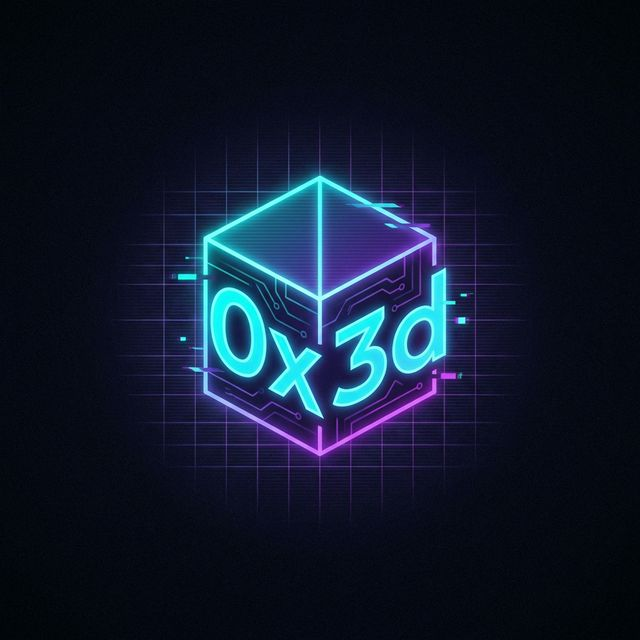

# 0x3d Hub 🌌

**0x3d Hub** is a premium, high-performance technical knowledge nexus. It curates advanced resources, development patterns, and digital frontiers into a unified, aesthetic dashboard.



## 🚀 Key Features

- **Multi-Hub Architecture**: Dedicated sections for Python, JS, C/C++, Rust, Go, and Nim.
- **Specialized Resource Centers**: Curated repositories for AI & ML, Cybersecurity, Design, and DevOps.
- **Master Vault**: A massive, categorized archive of 2,200+ technical links and web tools.
- **Site-Wide Regex Search**: Rapidly find any resource or blog post with `Ctrl + /`.
- **Admin CMS**: A lightweight, client-side dashboard to manage and edit resource databases directly.
- **Static & Fast**: Built with vanilla HTML, CSS, and JS. No database required—powered by Markdown.

## 📂 Project Structure

- `/content/db/`: Markdown-based resource databases.
- `/resources/`: Dynamic hub pages.
- `/admin/`: CMS dashboard for managing content.
- `/js/`: Core logic (Markdown loader, Search engine).
- `/css/`: Design system and glassmorphic UI.

## 🛠️ Local Development

1. Clone the repository.
2. Serve the directory using any static web server:
   ```bash
   # Using Python
   python3 -m http.server 8000
   ```
3. Access at `http://localhost:8000`.

## 🌐 Deployment (GitHub Pages)

This project is a **static site**, making it 100% compatible with **GitHub Pages**.

1. Push your code to a GitHub repository.
2. Go to **Settings > Pages**.
3. Under **Build and deployment**, select:
   - **Source**: Deploy from a branch.
   - **Branch**: `main` (or your default branch) and folder `/ (root)`.
4. Click **Save**.
5. Your site will be live at `https://<username>.github.io/<repo-name>/`.

---

*Curating the future of technical knowledge.*
